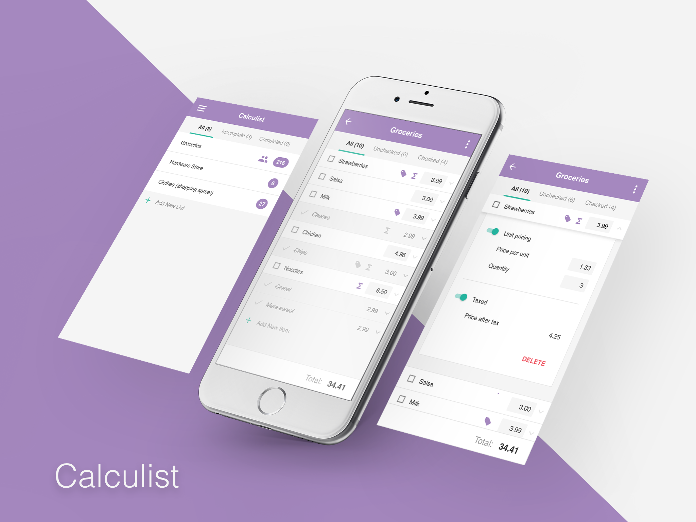

# Calculist (server-side) #
Your in-store shopping cart total. Know what you're spending before you spend it.

I am currently responsible for all design & development efforts.

## Requirements ##
This repository contains the server-side code, and is meant to be used in conjunction with the client-side app. You can download the client-side code [here](https://github.com/stuffmattdoes/react-calculist-client).

Your development environment needs the following software installed:

* [Node.js & NPM](https://nodejs.org/en/) - API server
* [MongoDB](https://www.mongodb.com/) - Database

## Setup ##
Run the following commands in terminal/console in order to get setup locally:

1. `npm install` to install all development dependencies

## Development ##
Run the following commands in terminal/console in order to develop locally:

1. `npm start` to start up the Node server, which will serve as our local API server instance.
2. Dev away!

## Deployment ##
You shouldn't be deploying my code! But if you must know, I host the this server-side portion of the Calculist app up on Heroku.

Head over to [calculist.stuffmattdoes.com](https://calculist.stuffmattdoes.com) to register and shop on a budget!

## Roadmap ##
This app is in active development. To see a list of planned features, check out my [Calculist Trello board](https://trello.com/b/ZQUkXrIX/calculist).